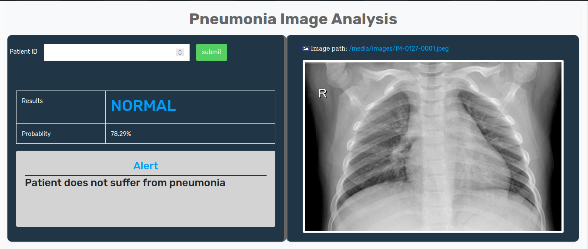

# Pneumonia Image Analysis(PIA)

Currently the analysis of x-ray image for pneumonia diagnosis is performed manually which result to delay of decision making and treatment due to lack of laboratory technology in most of the developing countries and lack of manpower for analyzing the x-ray images. Therefore, there is a need to have a computerized information system that will help in the analysis of such images in an effective and efficient manner. The artificial intelligence solution for pneumonia image analysis will help to analyze the x-ray images and assist in reducing the hospital queue, improving efficient which will result to making early informed decision that will reduce mortality and morbidity rate which will help to achieve one the millennium development goals.

<h1>Radiologist Interface</h1>

<h1>Doctor Interface</h1>

<h1>Pneumonia Positive</h1>

<h1>Pneumonia Negative</h1>
